# 23 Best E-commerce Platforms in 2025

Feeling overwhelmed by the sheer number of options for selling your products online? You're not alone. Choosing the right global e-commerce platform can feel like navigating a maze, but it's the key to unlocking a worldwide customer base. This guide cuts through the noise, showing you the most stable, efficient, and user-friendly online marketplaces to expand your reach and make cross-border selling a breeze.

## **[AliExpress](https://aliexpress.com)**

A massive global retail marketplace that connects sellers directly with buyers in over 220 countries and regions, making it a go-to for businesses looking for immense international exposure.

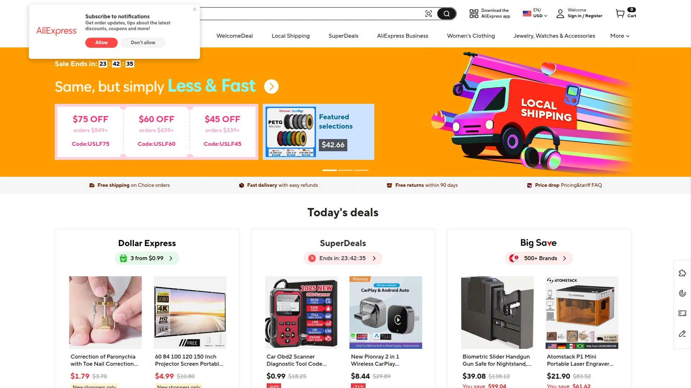

It was launched in 2010 as a business-to-consumer (B2C) offshoot of the wholesale giant Alibaba, designed to serve individual buyers and small-to-medium-sized businesses. Sellers benefit from access to a vast, built-in audience of over 150 million active buyers and can list products across 22 major categories. The platform is known for its competitive pricing, often because it allows customers to buy directly from manufacturers. It supports 18 languages and offers various tools to manage pricing and run promotions, creating a low-barrier entry point for sellers aiming for a global footprint.

## **[Amazon](https://amazon.com)**

The undisputed giant of global e-commerce, offering sellers access to hundreds of millions of customers and a sophisticated fulfillment network that handles storage, packing, and shipping.

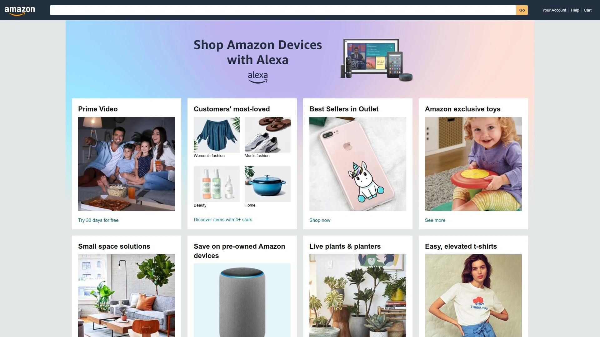

Amazon's marketplace is a powerhouse for sellers of all sizes, from individual artisans to multinational brands. It operates dedicated sites in numerous countries and provides a suite of tools for advertising and brand building. The "Fulfillment by Amazon" (FBA) service is a game-changer, allowing sellers to offer Prime shipping benefits, which can significantly boost visibility and sales. While the platform is competitive, its sheer volume of traffic makes it an essential channel for many online retailers.

## **[eBay](https://partnernetwork.ebay.com)**

A pioneering online marketplace that connects millions of buyers and sellers in over 190 markets, known for its auction-style listings alongside traditional fixed-price sales.

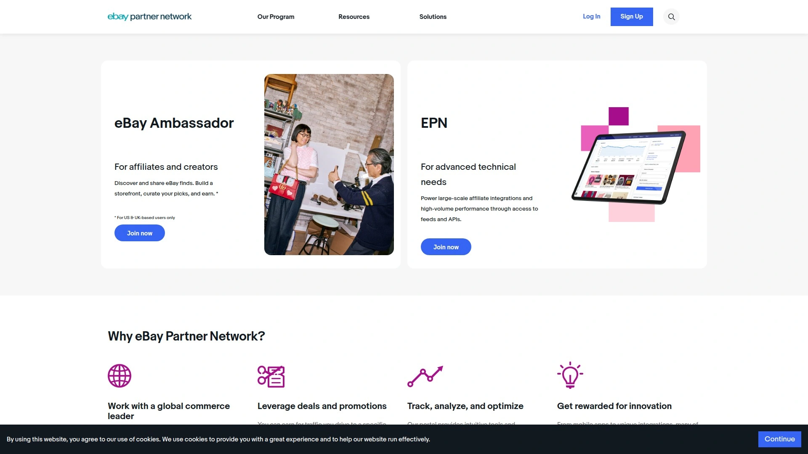

eBay is incredibly versatile, catering to everything from brand-new electronics and fashion to rare collectibles and used goods. This flexibility makes it a great platform for sellers with diverse or niche inventories. It offers a robust set of tools for managing listings and tracking sales. For businesses looking to reach a global audience with a wide variety of product types, eBay provides a flexible and well-established channel.

## **[Shopify](https://www.shopify.com)**

A leading all-in-one commerce platform that allows anyone to set up an online store and sell their products, not just on their own website but across multiple channels.

Unlike a marketplace, Shopify gives you the tools to build your own branded e-commerce site from the ground up. It's renowned for its user-friendly interface, extensive app store for adding functionality, and powerful features for managing everything from inventory to payments. It also integrates seamlessly with other marketplaces and social media platforms, making it a powerful hub for a multi-channel sales strategy.

## **[Walmart Marketplace](https://marketplace.walmart.com)**

An online marketplace from one of the world's largest retailers, giving third-party sellers the opportunity to list their products on Walmart.com and reach a massive US customer base.

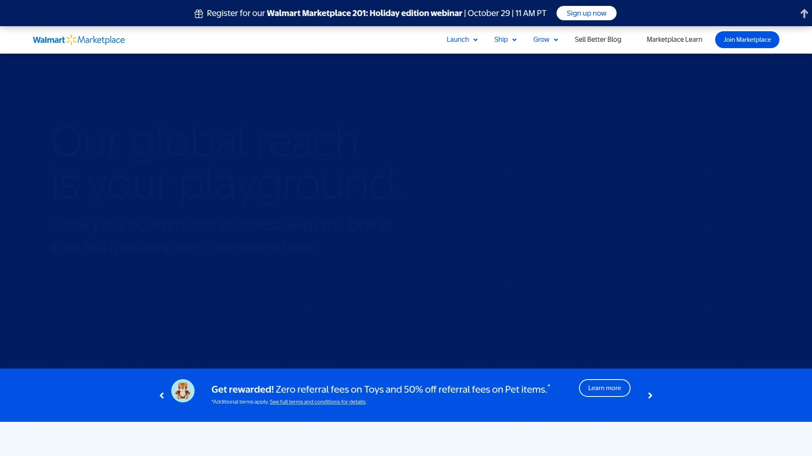

Leveraging its huge physical retail footprint and brand recognition, Walmart has become a major force in e-commerce. Selling on the Walmart Marketplace can place your products in front of millions of loyal shoppers. The platform is particularly strong for established businesses with competitive pricing and reliable fulfillment capabilities. It offers tools that help sellers manage their listings and tap into Walmart's extensive logistics network.

## **[Rakuten](https://www.rakuten.com)**

A major Japanese e-commerce platform that has expanded globally, often referred to as the "Amazon of Japan," offering a wide range of products and a popular loyalty points system.

Rakuten operates a B2C marketplace model, providing a platform for merchants to sell directly to consumers. It gives sellers more control over their storefronts and branding compared to some other large marketplaces. With a strong presence in Asia and a growing footprint in the US and Europe, it's an excellent choice for businesses looking to expand into these key markets.

## **[Shopee](https://shopee.com)**

A dominant e-commerce platform in Southeast Asia and Taiwan, known for its mobile-first approach and social features that make online shopping engaging and interactive.

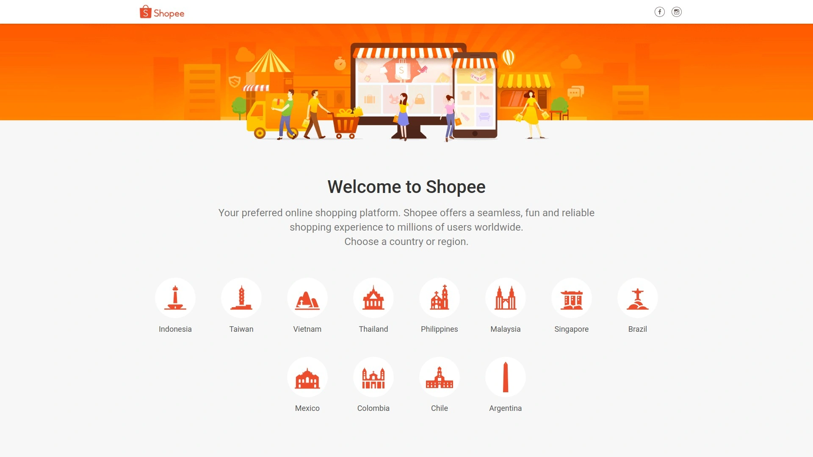

Launched in 2015, Shopee quickly grew by catering to the unique needs of the Southeast Asian market, offering features like integrated payments, logistics support, and a "shoppertainment" experience with in-app games and live streaming. For sellers targeting this fast-growing region, Shopee is an indispensable platform.

## **[Etsy](https://www.etsy.com)**

A global marketplace for unique and creative goods, specializing in handmade items, vintage products, and craft supplies.

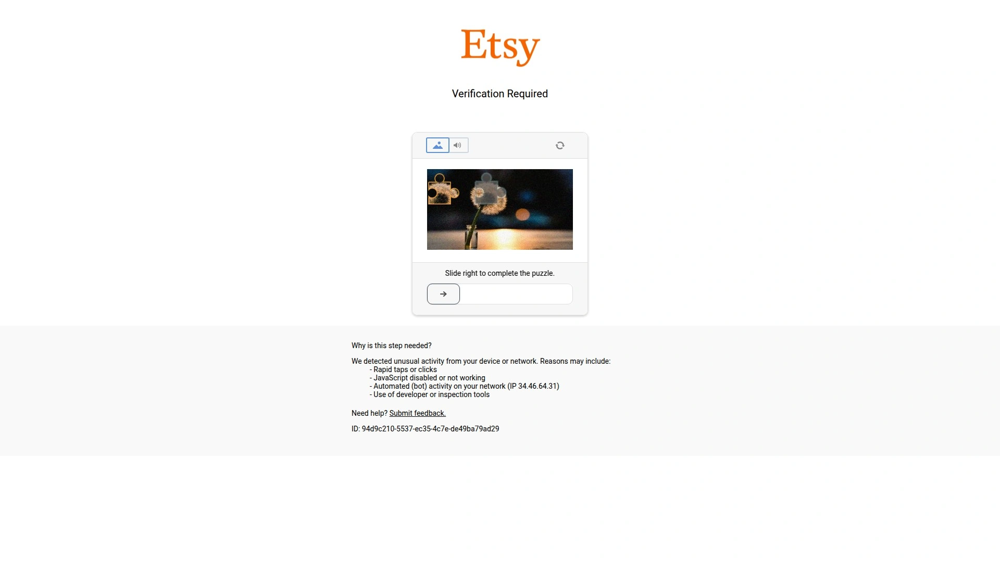

Etsy has cultivated a strong community of artisans and buyers who value originality and craftsmanship. It's the ideal platform for individual creators, artists, and small businesses selling non-mass-produced goods. The platform provides tools to help sellers market their shops and connect with a dedicated customer base looking for one-of-a-kind products.

## **[Mercado Libre](https://www.mercadolibre.com)**

The leading e-commerce ecosystem in Latin America, offering a wide range of services including a marketplace, a payment system (Mercado Pago), and a logistics solution (Mercado Envíos).

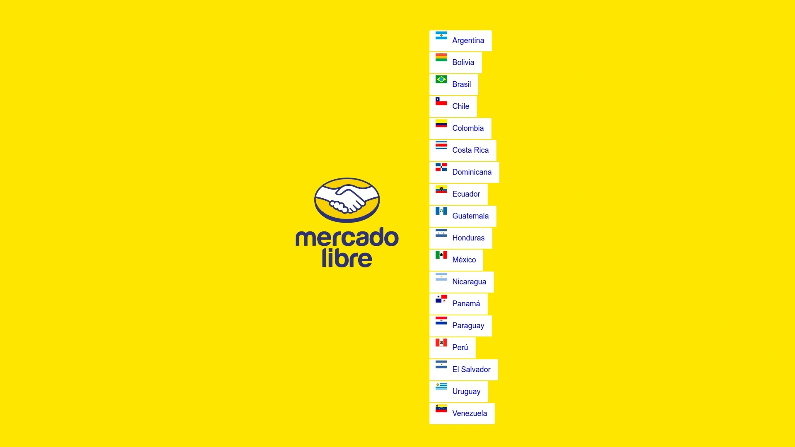

Dominating the market in countries like Brazil, Mexico, and Argentina, Mercado Libre is the gateway to Latin American consumers. It functions as an all-encompassing platform where sellers can list products, process payments securely, and handle shipping efficiently within the region. For any business serious about selling in Latin America, it's the most important platform to be on.

## **[Taobao](https://world.taobao.com)**

A massive Chinese online shopping website owned by Alibaba, operating on a consumer-to-consumer (C2C) model and known for its vast selection of products sold by millions of individuals and small businesses.

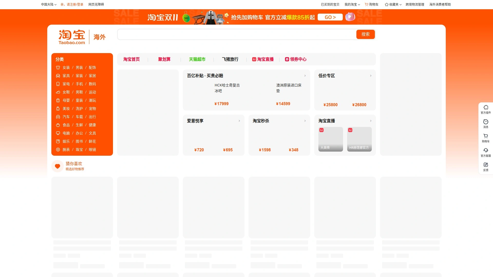

Taobao is a universe of its own within the Chinese e-commerce landscape. It offers an incredible variety of goods at extremely competitive prices. While primarily focused on the domestic Chinese market, its influence and scale are so large that it has become a major sourcing destination for buyers globally.

## **[JD.com](https://www.jd.com)**

A major Chinese e-commerce company known for its focus on authentic, high-quality goods and its incredibly advanced in-house logistics network.

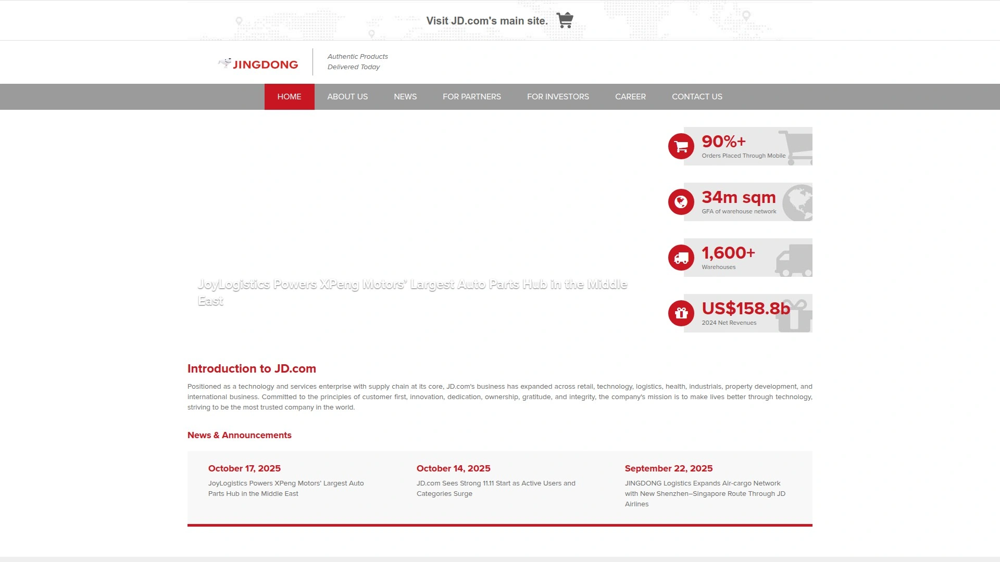

JD.com operates on a direct sales model, holding inventory for many of the products it sells, which allows for stringent quality control and exceptionally fast delivery. It's a trusted platform for consumers seeking electronics, home appliances, and luxury goods, making it a premium channel for brands in China.

## **[BigCommerce](https://www.bigcommerce.com)**

A flexible and scalable SaaS e-commerce platform that serves both growing businesses and large enterprises, known for its strong built-in features and low total cost of ownership.

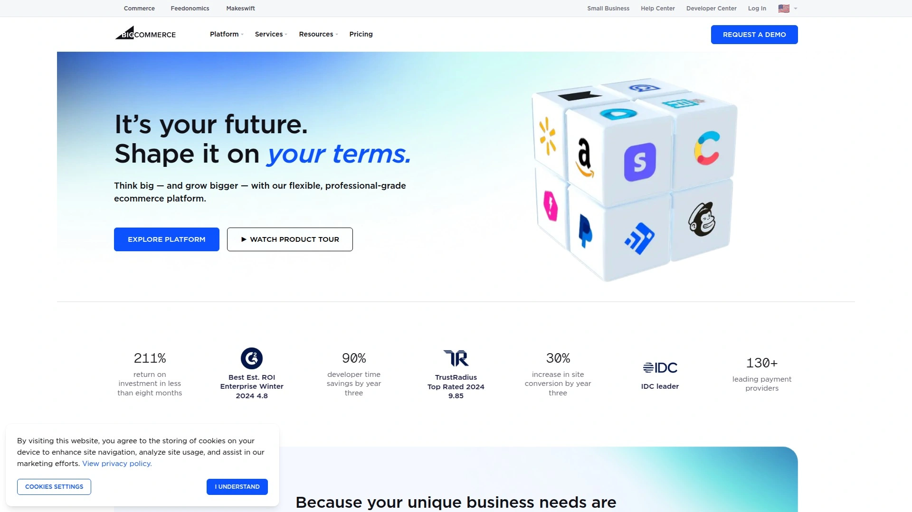

BigCommerce provides merchants with the tools to create a sophisticated online store without needing extensive technical knowledge. It supports multi-currency and multi-language capabilities, making it well-suited for international sales. The platform is designed to be highly customizable, allowing businesses to create unique shopping experiences.

## **[Adobe Commerce (formerly Magento)](https://business.adobe.com/products/magento/magento-commerce.html)**

A powerful and highly flexible open-source e-commerce platform favored by businesses that require extensive customization and control over their online store's functionality.

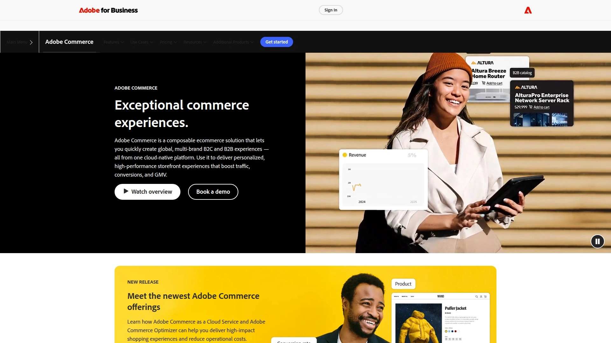

Adobe Commerce is designed for scalability, serving medium to large-sized businesses with complex needs. Its open-source nature means developers can modify the code to build bespoke features and integrations. It's a top choice for merchants who want to create a truly unique and powerful e-commerce presence without limitations.

## **[Flipkart](https://www.flipkart.com)**

India's largest domestic e-commerce marketplace, offering a vast range of products from electronics and fashion to groceries and home essentials.

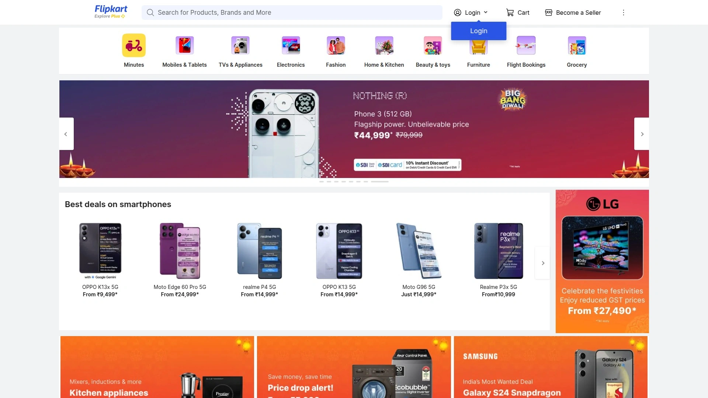

As a leader in the Indian market, Flipkart provides sellers with access to a massive and rapidly growing online consumer base. Backed by Walmart, it has built a robust logistics and fulfillment network across the country, making it a critical platform for any business wanting to succeed in India.

## **[Zalando](https://www.zalando.com)**

A leading European e-commerce platform focused on fashion and lifestyle products, with a strong presence in over 20 European markets.

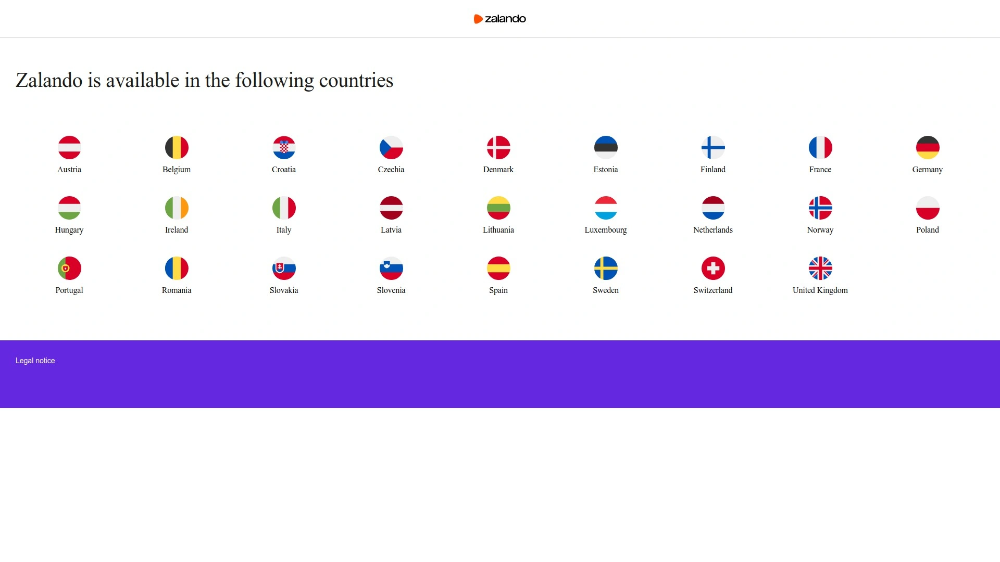

Zalando connects customers with a wide array of fashion brands, from high-street labels to designer names. It provides partner brands with access to a huge, fashion-savvy audience and offers services to help with marketing and fulfillment, making it a powerful channel for fashion retailers in Europe.

## **[OTTO](https://www.otto.de/‎)**

A major German e-commerce company that started as a mail-order business and has transformed into one of Europe's largest online retailers, with a focus on fashion, lifestyle, and home goods.

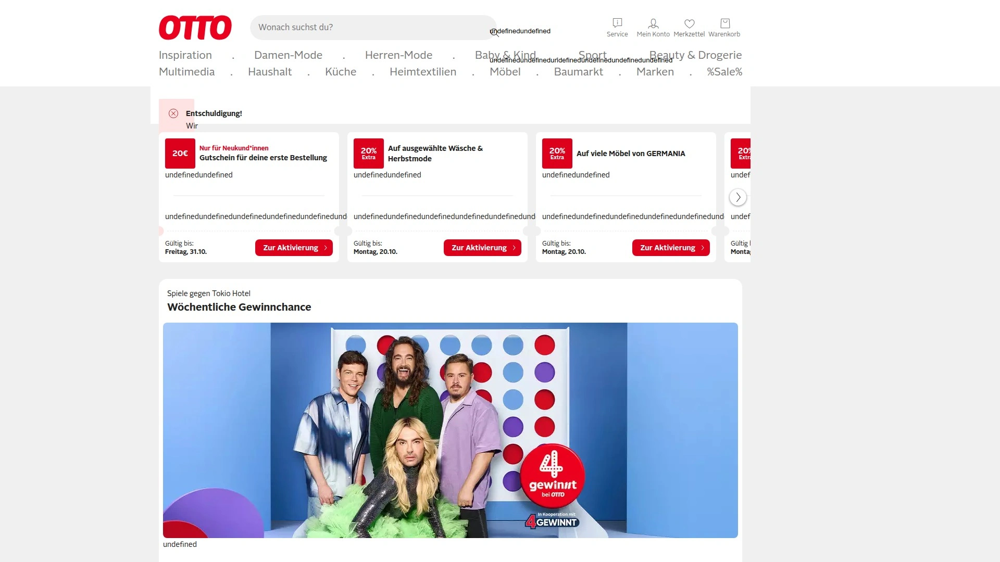

OTTO has a large and loyal customer base, particularly in Germany. It operates as a marketplace, allowing third-party sellers to list their products alongside its own retail offerings, providing a trusted channel to reach German consumers.

## **[WooCommerce](https://woocommerce.com)**

A free, open-source e-commerce plugin for WordPress that allows merchants to turn their WordPress site into a fully functional online store.

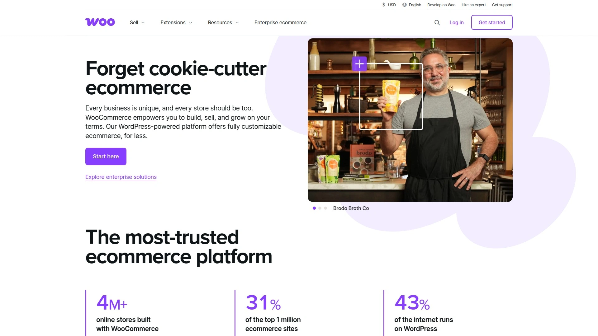

WooCommerce is incredibly popular due to its flexibility, customizability, and integration with the world's most used content management system. It's an excellent choice for small to medium-sized businesses that already use WordPress and want full control over their store's design and functionality without monthly platform fees.

## **[Volusion](https://www.volusion.com)**

An all-in-one e-commerce platform that provides small and medium-sized businesses with the tools to create, manage, and grow their online store.

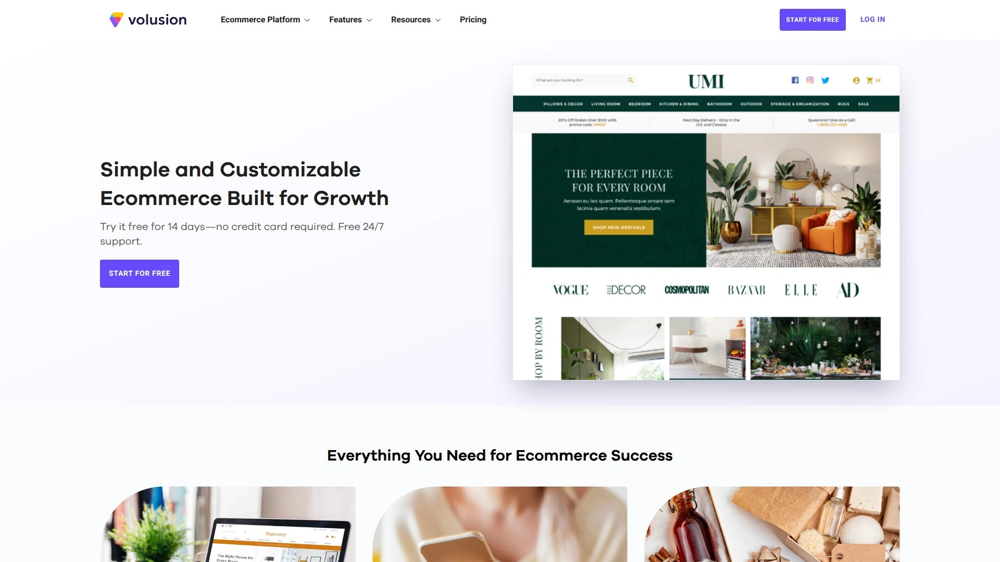

Volusion has been a player in the e-commerce space for a long time, offering a straightforward platform with a good set of built-in features, including inventory management and marketing tools. It's a solid choice for entrepreneurs and businesses looking for a reliable and easy-to-use solution.

## **[MyDeal](https://www.mydeal.com.au)**

An Australian online marketplace that focuses on products for the home and garden, including furniture, appliances, and homewares.

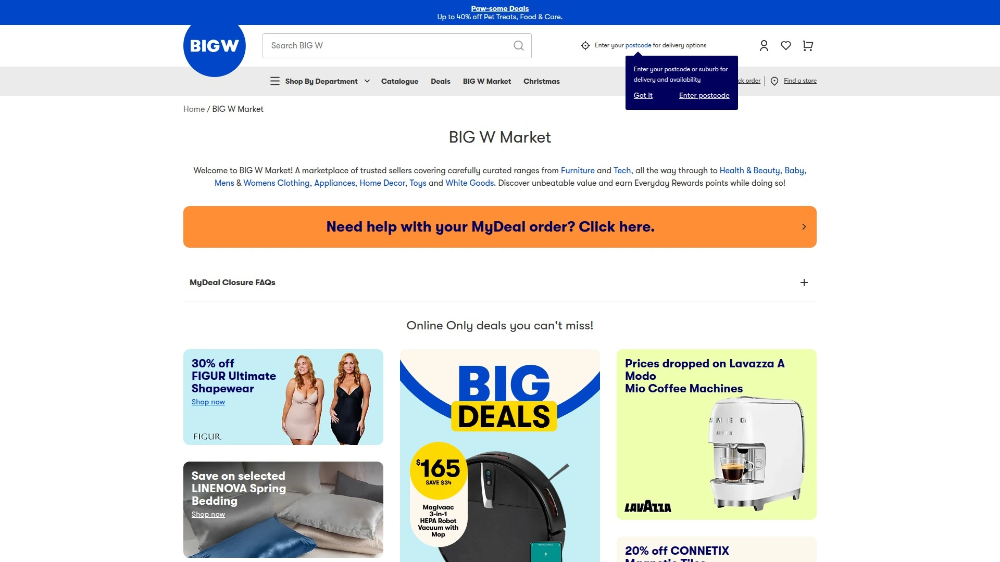

MyDeal is a pure marketplace, meaning it doesn't sell its own products, focusing instead on supporting its third-party sellers. It's a strong channel for businesses targeting the Australian market with home-related goods, offering access to millions of active shoppers in the region.

## **[Cdiscount](https://www.cdiscount.com)**

A major French e-commerce platform offering a wide variety of products, often at competitive prices, making it one of the most visited online retail sites in France.

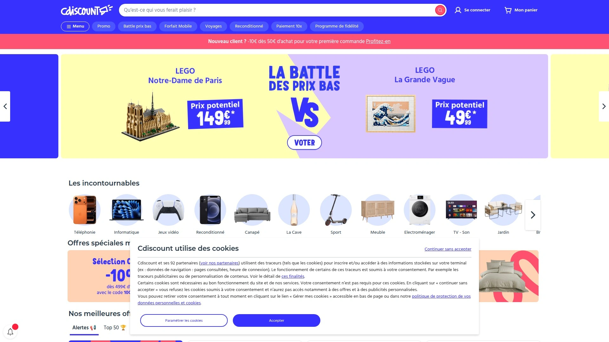

Similar to Amazon, Cdiscount offers everything from electronics and home appliances to toys and wine. It has a strong focus on the French market and provides a marketplace for third-party sellers to reach its large customer base.

## **[ClickBank](https://www.clickbank.com)**

A global marketplace primarily focused on digital products and software, connecting product creators with marketers who can help sell their goods.

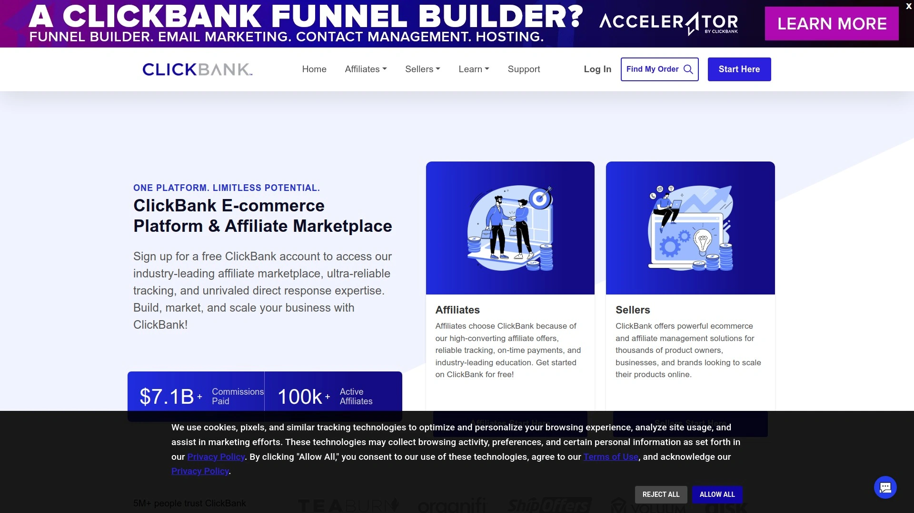

ClickBank is unique in that it specializes in the lifestyle and digital content space, such as e-books, online courses, and software. It's a powerful platform for entrepreneurs who create and sell digital products and are looking for a network to help them reach a wider audience.

## **[3dcart (now Shift4Shop)](https://www.shift4shop.com)**

An e-commerce platform known for its comprehensive feature set, even on its entry-level plans, making it a great value for small and medium-sized businesses.

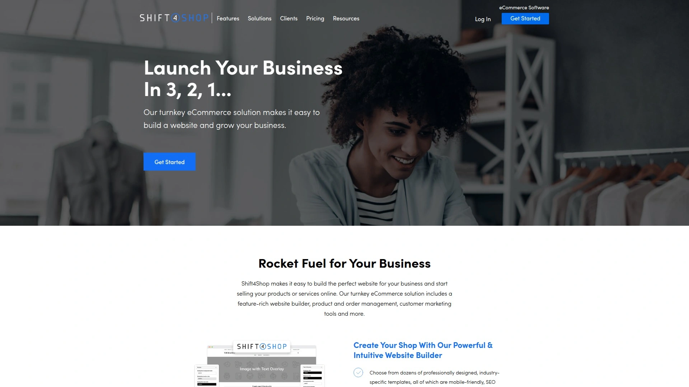

Shift4Shop offers a robust, all-in-one solution for building and managing an online store. It includes a wide range of built-in tools for SEO, marketing, and inventory management, providing a powerful alternative to other major SaaS platforms.

## **[Syncio](https://syncio.co)**

A platform designed for e-commerce partnerships, allowing stores to sync inventory across multiple Shopify stores, effectively turning them into a network.

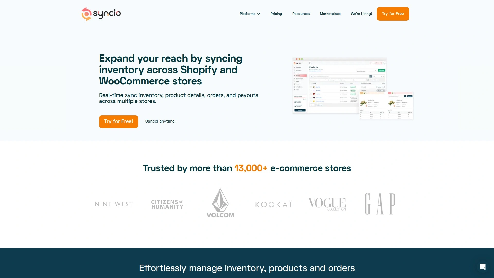

Syncio is perfect for brands that want to collaborate with other retailers or manage multiple storefronts. It automates inventory management, so when a product sells on one partner's store, the stock is updated across all connected stores. This facilitates collaborations like dropshipping and multi-brand retail without the risk of overselling.

## **Frequently Asked Questions**

**How do I choose the right e-commerce platform for my business?**
Focus on your specific needs. Consider your product type (e.g., handmade vs. mass-produced), your target market (e.g., domestic vs. global), and your technical skill level. A marketplace like Amazon is great for reaching a huge audience quickly, while a platform like Shopify offers more brand control.

**Can I sell on multiple platforms at once?**
Yes, and it's often a smart strategy. Multi-channel selling increases your visibility and diversifies your risk. Just be sure you have a system, perhaps using an inventory management tool, to keep track of sales and stock levels across all platforms to avoid overselling.

**What's more important: a platform's features or its user base?**
Both are critical and work together. A platform with millions of users is useless if you don't have the right tools to manage your listings and process orders efficiently. Conversely, the best tools in the world won't help if there are no customers to buy your products. The best choice is a platform that offers a healthy balance of both.

## **Conclusion**

Choosing the right platform is the first step toward building a successful online business, and the options are more diverse and powerful than ever. By understanding the unique strengths of each, you can find the perfect fit for your brand's journey. As we've seen, for sellers looking to tap into a massive global audience with minimal setup, [AliExpress](https://aliexpress.com) offers an unparalleled starting point with its vast international reach.
